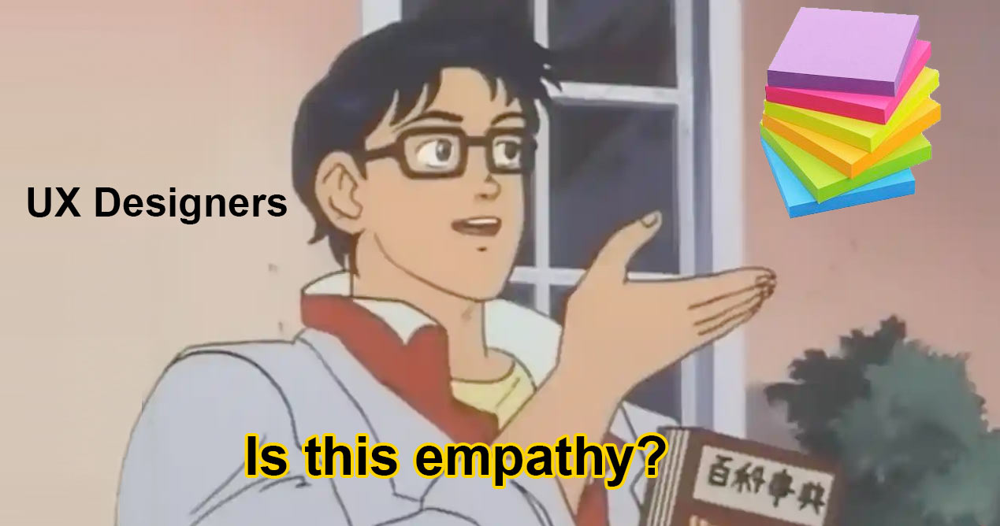

# Evil Code Quiz

## Subtitle

[Deployed Link](https://lshillman.github.io/evil-code-quiz/)

Description of project (also remember to add a blurb and the deployed link to the repo's "about" section)

What I did

## Technologies used:

* HTML
* CSS
* JS


## Code snippet

The following is _ and it's interesting/significant because _

````javascript
if (girl.walksIn && girl.waist == "itty bitty" && girl.roundThing.location == yourFace) {
    you.getSprung();
    return 0;
}
````

## UX wires/prototype

Here are the layouts/functionality I was going for...


## Screenshot of the live page and/or demo gif




## Credits

List collaborators and roles, and resources consulted:
https://www.w3.org/WAI/


## License

Talk to me if you want to use this.
