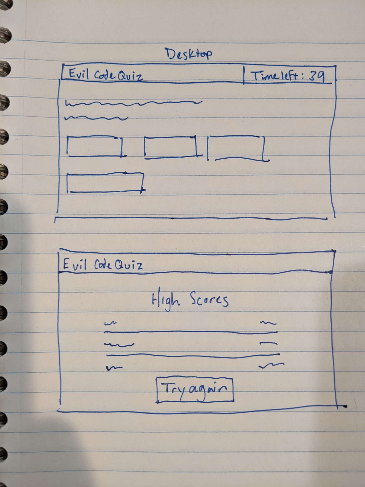

# Evil Code Quiz

## Do you dare [TAKE THE QUIZ](https://lshillman.github.io/evil-code-quiz/)?

This is a diabolical little JS code quiz that uses the latest in adversarial instructional design to sow discord and self-doubt in the minds of even experienced developers. There are only 10 multiple-choice questions, but the timer and penalty mechanisms, to say nothing of the atrocious readability, make this quite a challenge.

I used localStorage to keep track of high scores, so they'll stick around even if you close your browser. Feel free to take the quiz as many times as you like. Bet you can't beat my high score.

This is still a work in progress. Eventually there will be a larger question bank, and the computer will read each question aloud in a grating, high-pitched robot voice.

## Technologies used:

* HTML
* CSS
* JS


## Question shuffling

Any quiz that you can re-take has to implement some basic measures to ensure you're not just being tested on muscle memory. I originally was thinking I could implement the [Fisher-Yates algorithm](https://en.wikipedia.org/wiki/Fisher%E2%80%93Yates_shuffle), but I realized I could simply use Math.random to assign a value to each question in the bank (and its answer choices), and then sort() on those values. Genius, I say.

````javascript
function shuffleQuestions() {
    // shuffle the questions
    for (i=0; i < questionBank.length; i++) {
        questionBank[i].sortIndex = Math.floor(Math.random() * questionBank.length);
    }
    questionBank.sort((a, b) => b.sortIndex - a.sortIndex);

    // shuffle the answer choices
    for (i=0; i < questionBank.length; i++) {
        for (z=0; z < questionBank[i].choices.length; z++) {
            questionBank[i].choices[z].sortIndex = Math.floor(Math.random() * questionBank[i].choices.length);
        }
        questionBank[i].choices.sort((a, b) => b.sortIndex - a.sortIndex);
    }

}
````

## UX wires/prototype

Here are the layouts/functionality I was going for...


## Demo

https://user-images.githubusercontent.com/5232938/176321843-af48955f-ad70-4d35-bc32-599746e9873b.mov


## Credits

W3schools, as always, deserves all the credit for clarifying the confusing methods I used in this project. Spock's annoying verbal quiz at the beginning of Star Trek IV gets some credit for inspiration.


## License

Talk to me if you want to use this.
